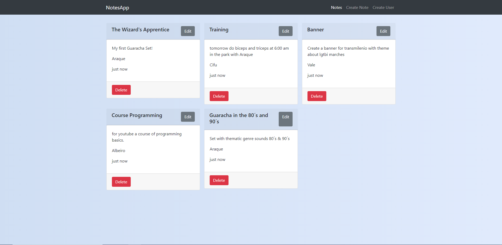
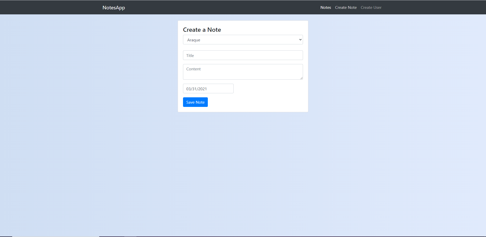

# NotesApp


NotesApp is an application where several users created by the same or other people, can make notes or tasks with a date when they must be fulfilled, in addition to creating, they can edit the task or the note and change the date of its completion.



On the home page we can see the list of the Notes or Tasks of each User, the Title, the Content of the task or note, Name of the person and Date when completing that task.

In the Action Buttons we see Edit where we edit our Note or task and Delete where we Delete Our note or Task.



In the Create Note section we see that you can select the User in which you will create your next note or task, below the title of the task, its content and the date on which you have to complete that task.


In the Create User section we create different users so that they can start creating their own tasks or notes, to Delete Users just double click and the clicked user will be Automatically Deleted.

# Backend

This Project is made with the MERN Stack (Mongo, Express, React, NodeJS), the Backend is 100% separate from the Frontend.

## Installation

```
git clone https://github.com/AraqueGD/NotesApp.git
cd backend
npm install
npm run dev
```

# Frontend

Frontend is made with REACT

## Installation

```
cd frontend
npm install
npm run start
```

# Improvements for the Future

- User Authentication
- User Authentication (Delete your Note or Task)
- Push Notification on expiration task or note

# Author

- Camilo Araque <https://github.com/AraqueGD>
